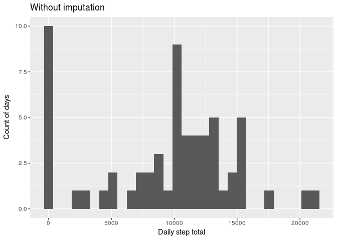

# Reproducible Research: Peer Assessment 1

```r
knitr::opts_chunk$set( warning=F, message=F)
options(scipen=10)
```


## Loading and preprocessing the data
Th data are provided in a zipped csv file. Here, we read that into a data.frame and convert the string representations of dates into th R Date type.

```r
library('tidyverse')
library('hms')
activityData <- read_csv('activity.zip')
activityData <- activityData %>% mutate(
  date = as.Date(date),
  interval = hms(minutes = interval %% 100, hours = floor(interval/100) )
)
```

## What is mean total number of steps taken per day?

This is equal to the total steps divided by the number of distinct days:

```r
dailyTotalSteps <- activityData %>% group_by(date) %>% summarise(summedSteps = sum(steps,na.rm=T))
meanStepsSimple <- mean(dailyTotalSteps$summedSteps)
medianStepsSimple <- median(dailyTotalSteps$summedSteps)
ggplot2::qplot(dailyTotalSteps$summedSteps,geom='histogram',xlab = 'Daily step total', ylab = 'Count of days', main = 'Without imputation')
```

<!-- -->

The mean and median counts of steps in a day are 9354 and 10395, respectively, when we ignore missing values.

## What is the average daily activity pattern?


```r
meanStepsByInterval <- activityData %>% group_by(interval) %>%
  summarise(averageSteps = mean(steps,na.rm=T))
ggplot2::qplot(interval,averageSteps,data=meanStepsByInterval, geom="line",
      xlab = "time", ylab = "average steps taken in 5-minute interval")
```

<!-- -->

```r
maxInterval <- with(meanStepsByInterval,interval[which.max(averageSteps)])
```

The interval with the highest mean step count is the 5 minutes from 08:35:00.

## Imputing missing values
We use dplyr to replace missing values with the mean for their interval in other days, following this Stackoverflow [answer](http://stackoverflow.com/a/9322975).

```r
impute.mean <- function(x) replace(x, is.na(x), mean(x, na.rm = TRUE))
activityDataImputed <- activityData %>% group_by(interval) %>%
  mutate( steps = impute.mean(steps) ) %>% ungroup
```

Now we check how the imputation changes our statistics.

```r
dailyTotalStepsImputed <- activityDataImputed %>% group_by(date) %>% summarise(summedSteps = sum(steps))
meanStepsImputed <- mean(dailyTotalStepsImputed$summedSteps)
medianStepsImputed <- median(dailyTotalStepsImputed$summedSteps)
ggplot2::qplot(dailyTotalStepsImputed$summedSteps,geom = 'histogram',
               xlab = 'Daily step total', ylab = 'Count of days', main = 'With imputation')
```

<!-- -->

The mean and median counts of steps in a day are 10766 and 10766, respectively, when we impute missing values using the interval means from other days. Days which contain no data are imputed as having the mean number of steps for each interval and hence the mean number of steps in a day as their daily total. The median of the data set with imputation happens to be at one of these fully-imputed days. The mean and the median daily step count are both increased as a result of imputing the missing data.

## Are there differences in activity patterns between weekdays and weekends?

We use `weekdays` to add a factor variable weekend or weekday. The line plots show a less pronounced spike in the mid-morning, presumably because people are less likely to be travelling to work.

```r
activityDataImputed <- activityDataImputed %>% 
  mutate(weekness = ifelse(weekdays(date) %in% c("Saturday","Sunday"),"weekend","weekday") )

meanStepsByIntervalImputed <- activityDataImputed %>% group_by(interval,weekness) %>%
  summarise(averageSteps = mean(steps,na.rm=T))

p <- ggplot(meanStepsByIntervalImputed) +
  geom_line(mapping=aes(x=interval,y=averageSteps)) + 
  facet_grid(weekness~.) + xlab('time') + 
  ylab('average steps taken in 5-minute interval')
print(p)
```

<!-- -->

